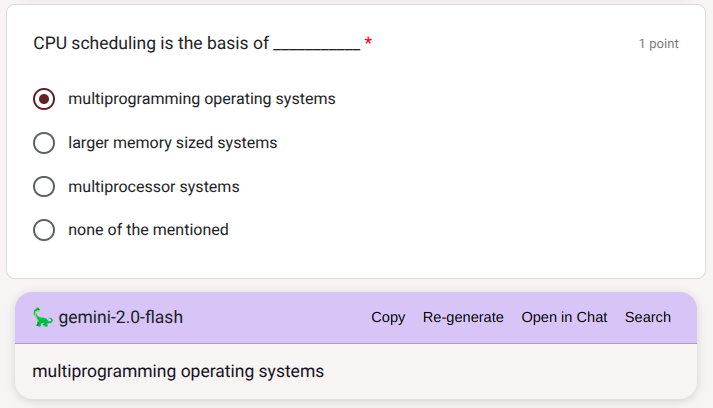

# Formify

Integrate your google form with AI 🚀 and let it solve them for you (Auto google-form solver 🐍)

## Google Formify Features 🐱

- Show AI answers at the bottom of your question
- Auto-select the correct option according to AI aswer
- Shortcut to hide/unhide the AI from someone
- Integrated Google Search for each question
- Integrated copy buttons for each question

## Shortcut 🐬

Press `ALT` + `K` key to quickly hide/unhide 🪼 the AI containers and elements from the form page.
Press `ALT` + `M` key to view/hide AI settings

☢️ **DESCLAIMER:** Cheating is bad like really. This project doesn's support cheating nor cheaters 🫵. It is recommended to test this script in a review mode and not on a real test/quizzes. By using this script, you acknowledge that you understand and agree to this disclaimer.

### 📸 Screenshot?

    
      

---

### 🤌 Installation:

1.  **Install a userscript-manager** (_any one_)

    -  [Tampermonkey](https://chrome.google.com/webstore/detail/tampermonkey/dhdgffkkebhmkfjojejmpbldmpobfkfo) or
    -  [Tampermonkey](https://addons.mozilla.org/firefox/addon/tampermonkey/) or
    -  [Tampermonkey](https://microsoftedge.microsoft.com/addons/detail/tampermonkey/dhhkcnkncnogfoefnondnaogonpedlnh) or
    -  [Tampermonkey](https://apps.apple.com/app/tampermonkey/id1482490089) or
    -  [Tampermonkey](https://addons.opera.com/extensions/details/tampermonkey-beta/)

> I recommend using tampermonkey to prevent any api issues. _Tested with violent monkey had some issues_.

2. **And install the script** (_from any one_)

   -  [Greasyfork.org](https://greasyfork.org/en/scripts/480209-google-formify) or

   -  [Github](https://github.com/rohitaryal/Formify/raw/refs/heads/main/dist/formify.user.js)

3. **(Optional)** You can check the script by filling up [THIS GOOGLE FORM](https://docs.google.com/forms/d/e/1FAIpQLSd5A4xLjNMmo9MxlMRSXYBiAd66eIHkrCInFNZ9aCs4HLIiyw/viewform)

## Changelogs 🤓

- Fixed Bugs
- New UI ☕
- Making code more OOP oriented 🐢
- Flexible UI scraping 🍭
- Can be used as a library for scraping form 🍷

---

_In case of bugs and errors please please please submit an issue :)_
